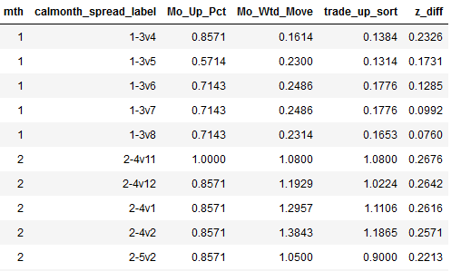
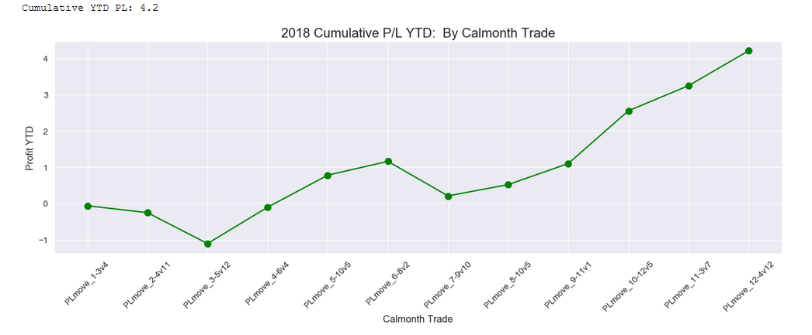

# Futures trade selection model
*Rank Seasonal Oil Trades and Backtest Profit/Loss*

***
###### ***Copyright © Justin Mackie. All Rights Reserved.  No one may distribute or create derivative works from my work without my written permission.  You are prohibited from using my code for commercial and/or business purposes.  However, you are permitted to fork and run my code solely for educational purposes on your personal (non-business) computer.***
***

#### <ins>Background:</ins>
Suppose we want to predict oil prices several months ahead.  Oil futures prices are daily time series data.  Each business day, there is one **settlement** price for the commodity.  Prices sort of repeat over the years in cyclical patterns called seasonality.  My model captures price patterns and computes the chance of the pattern repeating using historical prices.  The patterns are ranked strong to weak.  And they translate to financial trades in commodity futures.

The commodity illustrated in the model is Brent Crude, the key global price benchmark for Atlantic basin crude.  [Brent]( https://www.theice.com/products/219/Brent-Crude-Futures/specs)  is used to price the majority of Earth's internationally-traded crude supplies.

#### <ins>The Model:</ins>
My statistical seasonality model selects the best trades using historical data.  Then, cumulative trade Profit/Loss performance is tallied for the designated time period.  Model logic is built on Python and Pandas.  The Model reads and writes data from the SQLite3 database named **data.sqlite**.  Data visualizations are plotted with Seaborn and Matplotlib.

When picking a basket of financial trades (or a standalone trade), the odds a trade will move up or down is not the full picture.  Volatility and price path are relevant.  Volatility is relevant because a less volatile trade is better than a trade with wild price swings, all other things being equal.  Price path matters because as we go through time, a **cumulative trade return** of $1 that never dips negative is better than a (larger) cumulative trade return of $1.10 that swings to ($2.00) and later ($1.00).  Only a highly risk-tolerant investor would prefer the latter pattern.

The model visualizes trade movement, both in dollar terms and normalized z-score (move per unit of standard deviation).

#### <ins>Top 5 Long Trades by Contract Month: Jan and Feb shown</ins>

#### <ins>Brent Cumulative Profit-Loss for dozen selected trades:</ins>

We can run the model on a different commodity like West Texas Intermediate (WTI) or RBOB Gasoline Futures.  We just need appropriate data in a SQLite database!

*Please note:  Certain code is omitted from the model.  Full model is available upon request.*

#### <ins>Model Details:</ins>
blah,

#### <ins>Terminology:</ins>
* **Fit Years** - Years used in computing trade ranking stats.
* **Initial Price** - Price on Day before first day of month.
* **Last Price** - Last Price for day.
* **Roll Day** - Last day position is held.  For example, this may be a few days in advance of the expiration date.
* **Capital** - Position profit/loss.
* **Contract Month** - The month in which seller must deliver.  Ex. Delivery of one May-2019 Brent contract is physical delivery of 1,000 barrels of Brent in May.  The Ice Brent contract has the option to be cash settled.
* **Long Spread** - long front contract, short back contract.
* **Short Spread** - Short front contract, long back contract.
* **Front month** - first month in a spread.  Ex. 1 in a 1v3 spread.
* **Back month** - last  month in a spread.  Ex. 3 in a 1v3 spread.
* **calmonth_spread_label** - spread contract month with front and back contract.  Ex 1-3v6 is contract month 1 (Jan).  Front contract is month 3 (Mar) and back contract is month 6 (Jun).  The spread is the front price minus the back price.  That is the March minus June settlement price in this case.
* **z_diff** - z-score change between the month-start and month-end z-scores
* **Settles TABLE:** - settle - Daily settlement price of product
* **Spreads TABLE:** - spread - Settlement price difference for two different valid Contact Months on the same date.
* **Expiry TABLE:** - last_trade_date - the last day the Contract Month (prompt_month) is available.  Ex. BRENT future for May-2019  expired 03-29-2019.
